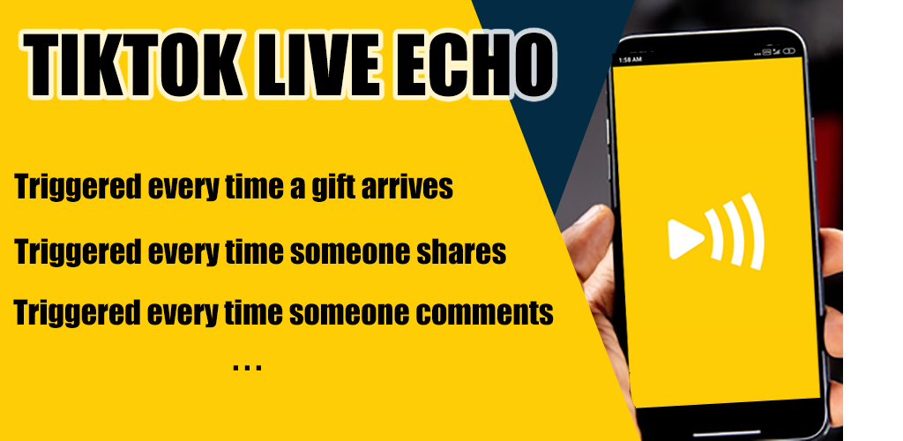
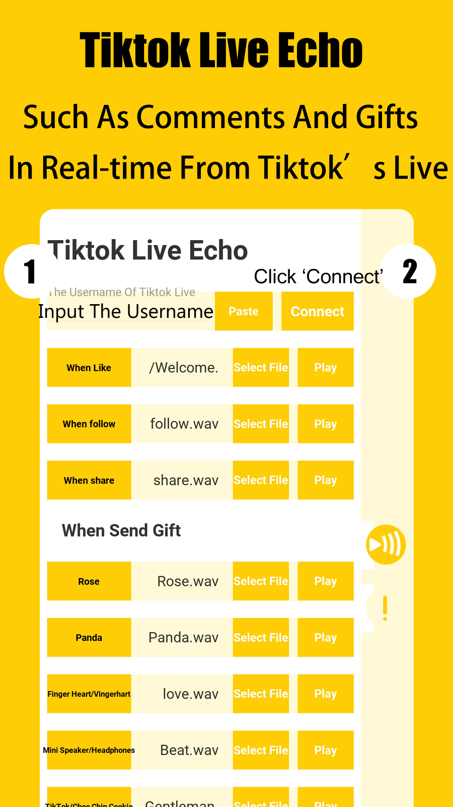

# TikTok Live Echo 
TikTokLive Android ---TikTok Live Echo 
==================
TikTokLive Android  With Kivy 

The App Can Echo Events Such As Comments And Gifts In Real-time From Tiktok’s Live
Input User’s Username(unique Id) And Press "connect" Button, Then The App Can Echo Events Such As Comments And Gifts In Real-time From Tiktok’s Live

This is an Android app developed using Python, Kivy KivyMD and TikTokLive.  
https://play.google.com/store/apps/details?id=com.tublm.livecho

allows you to join your livestream as well as that of other streamers. No credentials are required to use TikTokLive.
 ■ ■ ■TikTok Live Echo 
Triggered every time a new person joins the stream.
Triggered every time someone shares the stream.
Triggered every time someone follows the streamer.
Triggered every time someone comments on the live
Triggered every time a gift arrives.

**Dependencies:**
-   [Kivy](https://github.com/kivy/kivy)  == 2.0.0 ([Installation](https://kivy.org/doc/stable/gettingstarted/installation.html))
-   [TikTokLive](https://github.com/isaackogan/TikTokLive)  
-   [All]python3,aiohttp,kivy,kivymd,Pillow,TikTokLive,protobuf3-to-dict ,protobuf ,pyee ,dacite ,asynctest,multidict,attrs,async-timeout,aiosignal,typing-extensions,yarl,frozenlist,charset-normalizer,idna-ssl,six,idna,jnius,certifi,kivmob

Contributing
------------
You are welcome to improve and suggest changes to this application  .

 